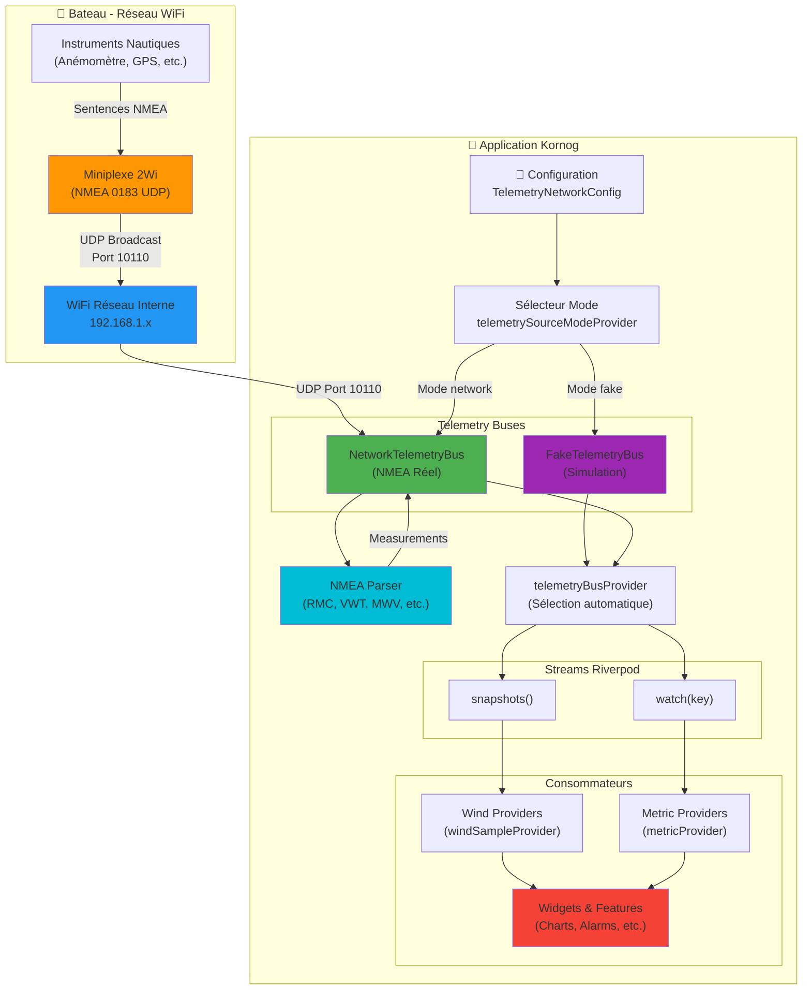
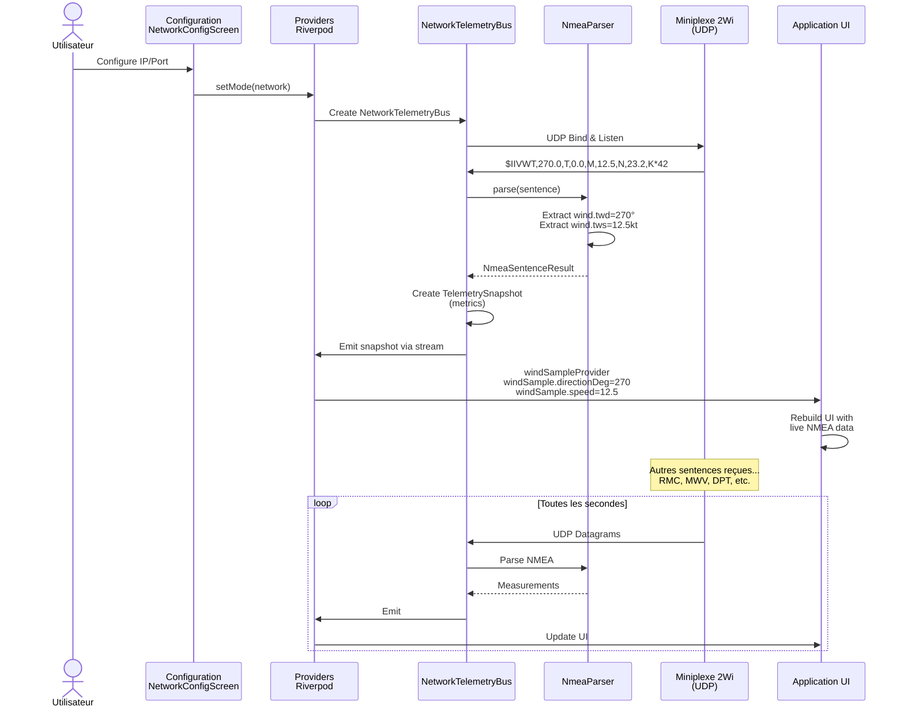
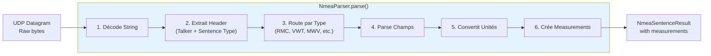
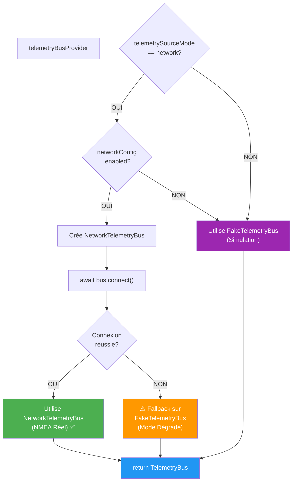
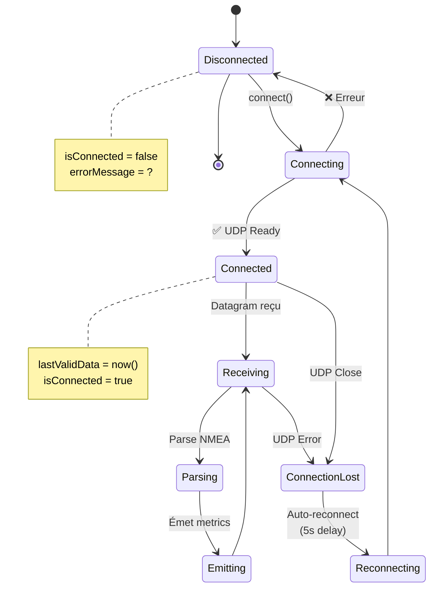
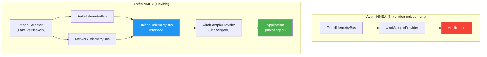
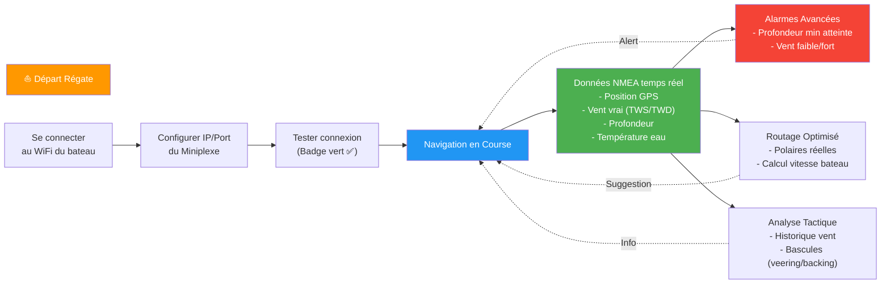

# Architecture NMEA 0183 Integration

## Diagramme de Flux Complet

## Flux de Données NMEA

## Architecture de Parsing

## Sélection Automatique de Source

## État de Connexion Réseau

## Intégration Transparente

## Cas d'Usage: Régate en Temps Réel

---

**Voir aussi:** `NMEA_INTEGRATION_GUIDE.md` pour documentation textuelle complète.
