# Architecture NMEA 0183 Integration

## Diagramme de Flux Complet

```mermaid
graph TB
    subgraph Bateau ["🚤 Bateau - Réseau WiFi"]
        Miniplexe["Miniplexe 2Wi<br/>(NMEA 0183 UDP)"]
        Instruments["Instruments Nautiques<br/>(Anémomètre, GPS, etc.)"]
        Instruments -->|Sentences NMEA| Miniplexe
        Miniplexe -->|UDP Broadcast<br/>Port 10110| Network["WiFi Réseau Interne<br/>192.168.1.x"]
    end

    subgraph App ["📱 Application Kornog"]
        Config["🔧 Configuration<br/>TelemetryNetworkConfig"]
        Selection["Sélecteur Mode<br/>telemetrySourceModeProvider"]
        
        subgraph Buses ["Telemetry Buses"]
            FakeBus["FakeTelemetryBus<br/>(Simulation)"]
            NetworkBus["NetworkTelemetryBus<br/>(NMEA Réel)"]
        end
        
        Parser["NMEA Parser<br/>(RMC, VWT, MWV, etc.)"]
        
        Provider["telemetryBusProvider<br/>(Sélection automatique)"]
        
        subgraph Streams ["Streams Riverpod"]
            Snapshot["snapshots()"]
            Watch["watch(key)"]
        end
        
        subgraph Consumers ["Consommateurs"]
            Wind["Wind Providers<br/>(windSampleProvider)"]
            Metrics["Metric Providers<br/>(metricProvider)"]
            Widgets["Widgets & Features<br/>(Charts, Alarms, etc.)"]
        end
    end

    Network -->|UDP Port 10110| NetworkBus
    NetworkBus --> Parser
    Parser -->|Measurements| NetworkBus
    
    Config --> Selection
    Selection -->|Mode fake| FakeBus
    Selection -->|Mode network| NetworkBus
    
    FakeBus --> Provider
    NetworkBus --> Provider
    
    Provider --> Snapshot
    Provider --> Watch
    
    Snapshot --> Wind
    Watch --> Metrics
    
    Wind --> Widgets
    Metrics --> Widgets
    
    style Miniplexe fill:#FF9800
    style Network fill:#2196F3
    style NetworkBus fill:#4CAF50
    style FakeBus fill:#9C27B0
    style Parser fill:#00BCD4
    style Widgets fill:#F44336
```

## Flux de Données NMEA

## Architecture de Parsing

## Sélection Automatique de Source

## État de Connexion Réseau

```mermaid
stateDiagram-v2
    [*] --> Disconnected
    
    Disconnected --> Connecting: connect()
    
    Connecting --> Connected: ✅ UDP Ready
    Connecting --> Disconnected: ❌ Erreur
    
    Connected --> Receiving: Datagram reçu
    
    Receiving --> Parsing: Parse NMEA
    Parsing --> Emitting: Émet metrics
    Emitting --> Receiving
    
    Receiving --> ConnectionLost: UDP Error
    Connected --> ConnectionLost: UDP Close
    
    ConnectionLost --> Reconnecting: Auto-reconnect<br/>(5s delay)
    Reconnecting --> Connecting
    
    Disconnected --> [*]
    
    note right of Connected
        lastValidData = now()
        isConnected = true
    end note
    
    note right of Disconnected
        isConnected = false
        errorMessage = ?
    end note
```

## Intégration Transparente

## Cas d'Usage: Régate en Temps Réel

```mermaid
graph LR
    Start["⛵ Départ Régate"]
    
    Connect["Se connecter<br/>au WiFi du bateau"]
    Config["Configurer IP/Port<br/>du Miniplexe"]
    Test["Tester connexion<br/>(Badge vert ✅)"]
    
    Race["Navigation en Course"]
    
    NMEA["Données NMEA temps réel<br/>- Position GPS<br/>- Vent vrai (TWS/TWD)<br/>- Profondeur<br/>- Température eau"]
    
    Alarms["Alarmes Avancées<br/>- Profondeur min atteinte<br/>- Vent faible/fort"]
    Routing["Routage Optimisé<br/>- Polaires réelles<br/>- Calcul vitesse bateau"]
    Analysis["Analyse Tactique<br/>- Historique vent<br/>- Bascules (veering/backing)"]
    
    Connect --> Config
    Config --> Test
    Test --> Race
    
    Race --> NMEA
    NMEA --> Alarms
    NMEA --> Routing
    NMEA --> Analysis
    
    Alarms -.->|Alert| Race
    Routing -.->|Suggestion| Race
    Analysis -.->|Info| Race
    
    style Start fill:#FF9800,color:#fff
    style NMEA fill:#4CAF50,color:#fff
    style Race fill:#2196F3,color:#fff
    style Alarms fill:#F44336,color:#fff
```

---

**Voir aussi:** `NMEA_INTEGRATION_GUIDE.md` pour documentation textuelle complète.
